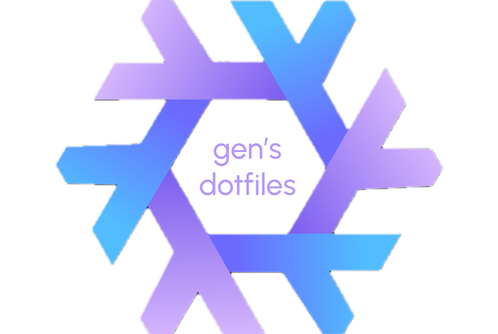

  
  <h1>Gen's macOS flake</h1>

  
  
  

## Credits

I'd like to thank those who had to suffer through helping me out with Nix! 💙

- [isabelroses](https://github.com/isabelroses)
- [uncenter](https://github.com/uncenter)
- [Nix Darwin Kickstarter](https://github.com/ryan4yin/nix-darwin-kickstarter/)
